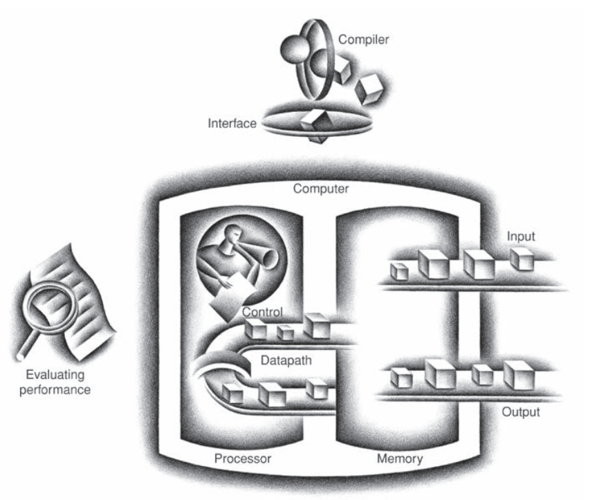

计算机由输入、输出、内存、控制器和数据通路五个部分组成，后面两者统称为处理器。书中的插图不错，形象的描绘了这几个部分的关系，包括之前小节提到的软件。

输入设备（`input device`）和输出设备（`output device`）会在第五章和第六章详细说明，这里先简要看下全局。

### Through the Looking Glass
现在个人移动设备或者 PC 配的显示器往往使用 LCD （`liquid crystal display`）技术，薄，功耗低。

最小显式单元是像素（`pixel`）。

### Touchscreen
个人移动设备使用触摸屏作为输入，替代了 PC 的键盘和鼠标。

### Opening the Box
拆开一个智能手机，也包含计算机的五个部分。

I/O 包含触摸屏、前/后置摄像头、麦克风、扬声器、加速计、陀螺仪等等。

其中还有一块集成电路（`integrated circuit`），也称芯片（`chip`），其中包含若干个处理器，大家称之为 CPU（`central processor unit`）。

处理器中就包含数据通路（`datapath`），执行算数操作，和控制器（`control`），告诉其他组件执行什么命令。

智能手机中还有内存（`memory`），是 DRAM（`dynamic random-access 
memory`）芯片，用于存储指令和数据。RAM 部分说明访问任意一个部分的时间是一样的。

再深入看，处理器中还包含缓存（`cache memory`），使用 SRAM（`static random-access memory`）技术，用于缓存 DRAM 的数据。SRAM 密度更低，更快，更贵。SRAM 与 DRAM 组成了两层的存储层次结构（`memory hierarchy`）。
