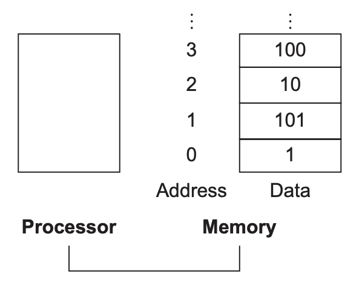

不像高级语言，算术指令的操作数必须存在有限个数的寄存器（`register`）中。RISC-V 架构的寄存器是 32 bits，称为一个字（`word`），另一个常见的长度是 64 bits，双字（`doubleword`）。

RISC-V 中有 32 个寄存器。算术指令的操作数必须是这些寄存器中的几个。

限制 32 个寄存器引出了硬件设计的第二个原则：

*Design Principle 2*: Smaller is faster.

*设计原则 2*：更小往往更快。

更多的寄存器可能会导致时钟周期变长。

更少往往更快并不是绝对的。31 个寄存器或许不必 32 个寄存器更快。这里深层次的原因是设计者在程序期望更多的寄存器和时钟周期越短越好之间的平衡。另一个不使用超过 32 个的原因是其在指令格式中占用的位数，2.5 节会给出描述。

第四章会介绍寄存器在硬件构建上处于中心位置，同时，高效地使用寄存器会影响程序的性能。

下面给出一个例子。
```c
f = (g + h) − (i + j);

// 假定这些变量对应的寄存器分别是 x19, x20, x21, x22, x23，那么对应的指令如下
add x5, x20, x21    // register x5 contains g + h
add x6, x22, x23    // register x6 contains i + j
sub x19, x5, x6     // f gets x5 – x6, which is (g + h) − (i + j)
```

### Memory Operands
上面的例子中，总是使用简单的类型，实际中可能会使用复杂的数据结构（比如结构体和数组）。这些数据量可能超过了所有寄存器的容量，那怎么办呢？

计算机一个重要组成部件是内存，这些数据都放在内存中。

如前所述，RISC-V 算术指令只能操作在寄存器中的数，所以 RISC-V 必须包含在寄存器和内存之间转移数据的指令，称为数据传送指令（`data transfer instructions`）。要访问内存中的字，必须知道其地址。可以将内存看做是一个很大的连续的一维数组，如下所示，第 3 个元素地址是 2，内存中的值是 10。


