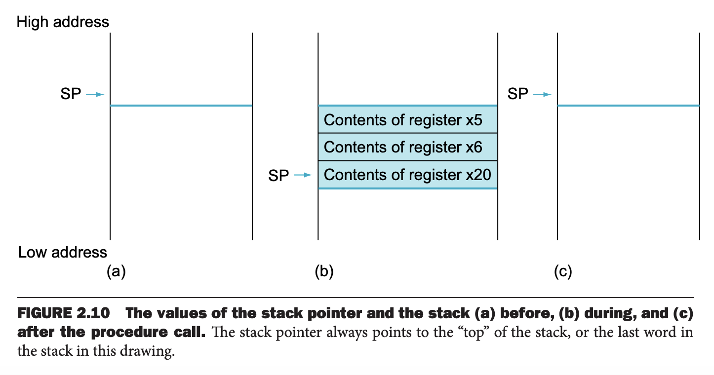

过程（`procedure`）或函数（`function`）是结构化程序的重要工具，使得程序更容易理解且能复用代码。过程是软件领域实现抽象的方式之一。

执行一个过程大致有如下六个步骤：
1. 将参数放到某个地方使得过程能够访问到。
2. 转移控制权给过程。
3. 获取必要的存储资源。
4. 执行。
5. 将结果放到某个地方使得程序能够访问到。
6. 返回控制权到原始调用过程的地方。

寄存器是访问最快的地方，所以要尽可能的使用它们。RISC-V 关于寄存器的使用有以下约定：
* `x10` - `x17` 用于传递参数和结果
* `x1` 用于保存返回到原点的地址

除此之外，RISC-V 提供 `jal` 指令（`jump-and-link instruction`）来实现调用过程。该指令跳转到一个地址，并且将紧接着这条指令的下一条指令的地址保存到指定寄存器中。
```c
jal x1, ProcedureAddress    // jump to ProcedureAddress and write return address to x1
```

指令名中 `link` 的含义是一个地址，使得过程能够返回到合适的地址继续执行程序。这个 `link`，或者说存在 `x1` 中的值，称为返回地址（`return address`）。需要返回地址的原因是同一个过程可能会在程序的不同地方被调用。

为了实现返回的功能，RISC-V 提供下面这个和 `jal` 类似的指令
```c
jalr x0, 0(x1)
```
`jalr`（`jump-and-link register instruction`）跳转到存放在 `x1` 寄存器的地址。调用者（`caller`）把参数放到 `x10` - `x17`，然后调用 `jal x1 X` 跳转到位于 X 地址的函数，这个函数是被调用函数（`callee`）。被调用函数执行运算，把结果放到放参数的寄存器，然后调用 `jalr x0, 0(x1)` 把控制权交回给调用者。

存储程序需要寄存器指向当前执行的指令的地址。历史原因，我们称这个寄存器为程序计数器（`program counter`），简写为 `PC`。更好的名字是指令地址寄存器（`instruction address register`）。`jal` 通常将 PC + 4 存到 `x1` 寄存器。

另外，`jal` 可以做无条件跳转。`x0` 通常放的是零，也就是只跳转到 Label 但是不返回。
```c
jal x0, Label   // unconditionally branch to Label
```

### Using More Registers
假设一个函数的参数个数多于八个，那么编译器需要更多寄存器。由于调用完成之后需要恢复调用之前的现场，任意寄存器的值需要恢复到执行函数之前。对于这个场景，我们需要把寄存器的内容 spill 到内存。

一个理想的数据结构是栈（`stack`）。栈需要一个指针指向最近的分配的地址，以指示下一个存放数据的地址。一般地，这样指针的称为堆栈指针（`stack pointer`），缩写为 `sp`，RISC-V 使用寄存器 `x2` 保存 `sp`。栈存储数据或者恢复数据，都需要调整堆栈指针，一次一个字。栈非常通用，数据操作有专有名词：入栈 `push` 和出栈 `pop`。

历史原因，栈从高地址向低地址增长，所以通过减堆栈指针来入栈，增加堆栈指针实现出栈。

#### Compiling a C Procedure That Doesn’t Call Another Procedure
现在分析下面 C 代码编译成什么样的汇编代码。这个 C 代码来自 2.2 节。
```c
int leaf_example (int g, int h, int i, int j)
{
    int f;

    f = (g + h) − (i + j);
    return f;
}
```

变量 `g, h, i, j` 对应寄存器 `x10, x11, x12, x13`，变量 `f` 对应寄存器 `x20`。编译函数首先要写一个标签：
```
leaf_example:
```

下一步需要保存这个函数要用的寄存器。类似于 2.2 节，这个函数还需要两个额外的临时寄存器 `x5, x6`。加上 `f` 对应的 `x20`，我们需要保存三个寄存器的值到栈上。
```c
addi sp, sp, -12    // adjust stack to make room for 3 items
sw x5, 8(sp)        // save register x5 for use afterwards
sw x6, 4(sp)        // save register x6 for use afterwards
sw x20, 0(sp)       // save register x20 for use afterwards
```

下面是这个过程对应的栈变化。



下面执行运算。
```c
add x5, x10, x11    // register x5 contains g + h
add x6, x12, x13    // register x6 contains i + j
sub x20, x5, x6     // f = x5 − x6, which is (g + h) − (i + j)
```

为了返回结果 `f` 的值，拷贝到参数寄存器
```c
addi x10, x20, 0    // returns f (x10 = x20 + 0)
```

返回之前，出栈以恢复现场
```c
lw x20, 0(sp)       // restore register x20 for caller
lw x6, 4(sp)        // restore register x6 for caller
lw x5, 8(sp)        // restore register x5 for caller
addi sp, sp, 12     // adjust stack to delete 3 items
```

最后跳转到返回地址
```c
jalr x0, 0(x1)      // branch back to calling routine
```

这个例子中，我们总是将要用到的临时寄存器的值保存起来再恢复出来。对于临时寄存器而言，我们不需要这么做，RISC-V 将寄存器中的 19 个分成了两组：
* `x5−x7, x28−x31` - 被调用者不必维护这些寄存器的值，可以随意使用。
* `x8−x9, x18−x27` - 被调用者需要维护这些寄存器的值，如果用到的话，那么就要存储和恢复里面的值。

根据这个约定，上面的例子可以不处理 `x5,x6`，减少 spill 寄存器的数量。不过还是需要处理 `x20` 的。

### Nested Procedures
不调用其他过程的过程称为叶子过程。如果只有叶子过程，一切都会非常简单。但是现实不是这样的。

比如主函数调用过程 A，参数 3 放到了 `x10` 中，并调用 `jal x1 A`，接着 A 调用 B，把参数 7 放到了 `x10` 中，并调用 `jal x1 B`。由于 A 还没有结束，所以这里有两个冲突，`x10` 中的数据变了，`x1` 中的返回地址也变了。

一个方案和之前类似，把这些值保存在栈上。调用者负责将参数寄存器 `x10–x17` 和自己用的临时寄存器 `x5−x7, x28−x31` 的值放到栈上，调用完成之后恢复。被调用者负责将返回地址寄存器 `x1` 和 自己可能要用的非临时寄存器 `x8−x9, x18−x27` 的值保存起来。`sp` 维护根据入栈的寄存器数量调整指针，恢复栈的数据到寄存器之后，调整指针位置进行出栈操作。

#### Compiling a Recursive C Procedure, Showing Nested Procedure Linking
