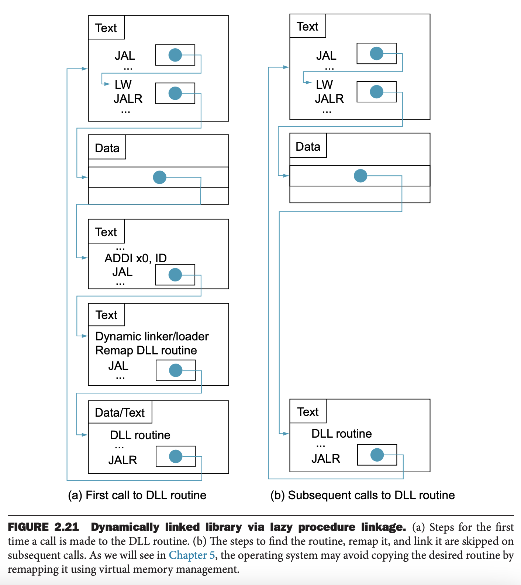

这个小节阐述由 C 程序编译成放到磁盘上的可执行文件以及执行的四个步骤。如下图所示。有的时候为了性能，有的步骤会合并在一起，但是逻辑上这四个步骤是必不可少的。


### Compiler
编译器将 C 代码翻译成汇编代码（`assembly language`）。高级语言的行数往往比汇编语言少很多，因此程序员的生产效率大大提升了。

1975，那时内存很小，所以使用汇编代码写操作系统和汇编器。随着内存容量的增长，编译器被优化到相当好的程序，生成的汇编代码和汇编语言专家写的一样好，有时会更好。

### Assembler
汇编语言是高级软件的接口，因此汇编器还可以将机器语言指令的常见变体视为它们本身的指令。硬件不需要有执行这些指令的能力；然而，它们的出现简化了翻译和编程。此类指令称为伪指令（`pseudoinstructions`）。

如前所述，RISC-V 的 `x0` 中的值永远是零，借助这一点，汇编器接受很多伪指令。比如
```
li x9, 123 // load immediate value 123 into register x9
```
而 RISC-V 是没有这条机器语言的。汇编器把这条汇编代码翻译成
```
addi x9, x0, 123 // register x9 gets register x0 + 123
```

RISC-V 的汇编器把 `mv` 翻译成 `addi`
```
mv x10, x11         // register x10 gets register x11
addi x10, x11, 0    // register x10 gets register x11 + 0
```
汇编器还接受 `j Label` 这样的汇编代码，无条件跳转到对应地方，表示 `jal x0, Label`。汇编器还可以将跳转到较远的代码翻译成一个分支跳转和一个无条件跳转。汇编器还能接受比机器指令更大的常量，比如 `li` 比 `addi` 的常量范围更大。此外，汇编器接受各种指令的变种，比如不需要汇编程序员指定立即数对应指令，如下汇编
```
and x9, x10, 15 // register x9 gets x10 AND 15
```
会被翻译成
```
andi x9, x10, 15 // register x9 gets x10 AND 15
```
显式地写后缀 `i` 能够让人清楚地看明白指令的的参数。

伪指令丰富了 RISC-V 的指令集使得程序员写代码更简单。不过为了理解架构以获得最好的性能，学习理解真实指令是必不可少的。为了减少迷惑，第二章和第三章会使用真实的指令。

汇编器除了二进制和十进制数之外，往往也接受其他进制的数。RISC-V 汇编器就接受八进制和十六进制数。

这些仅仅是提供便利，汇编器的主要功能是生成机器代码，将汇编代码编程对象文件（`object file`），包含指令、数据、指令放到内存地址的映射信息。

为了生成所有指令的二进制版本，汇编器需要处理所有的标签（`label`）。汇编器使用符号表（`symbol table`）保存跟踪所有的标签，其中存放的是标签到地址的映射。

UNIX 的对象文件包含下面六个部分的信息：
* 对象文件头（`object file header`）包含其他部分所在的位置和大小。
* 正文段（`text segment`）包含所有的机器代码。
* 静态数据段（`static data segment`）分配了程序运行周期需要的变量。
* 重定位信息（`relocation information`）用于确定程序加载到内存之后依赖绝对地址的指令和数据。
* 符号表（`symbol table`）包含尚未定义的符号，比如外部引用。
* 调试信息（`debugging information`）包含编译单元是如何编译的精确描述，使得调试器能够将机器指令和 C 代码关联起来，使数据结构可读。

### Linker
目前为止，我们描述的方法对于一个过程只改动了一行代码也需要重新编译整个程序，这相当耗时，特别是包含基本不再修改的类库。一个解决方法是各个文件（更准确的说法是编译单元）单独编译，然后由新的工具链接器（`link editor, linker`）把这些拼接在一起。

链接器的工作分成三个步骤：
* 将每个单元的代码和数据读入内存。
* 确定数据和指令标签的地址。
* 编辑内部和外部引用。

链接器使用每个对象文件中的重定位信息和符号表解析未处理的标签。这些引用出现在分支跳转和数据地址中，所以链接器的工作很像编辑器：使用新地址来替换旧地址。

如果所有外部引用都解析完成之后，需要确认每个模块占用的内存地址。2.8 节介绍过，RISC-V 对数据和指令放在哪里是有约定的，而现在每个模块单独编译，编译器无法知道这些指令和数据放到哪里。链接器必须将绝对引用（寄存器无关地址）都重新定位以放到正确的位置。

链接器的输出是一个可执行文件（`executable file`），也是对象文件格式，不过其中不包含未解析的引用。输出也可以是一个类库，其中可以包含没有解析的引用。

#### Linking Object Files
下面通过链接如下两个对象文件，分析如何地址以生成可执行文件。其中使用汇编而不是机器代码目的是更容易理解，真实情况这些都是些数字。

下面高亮的几个值，过程 `A, B` 和数据 `X, Y`，的值必须更新成真实值，也就是说过程 `A` 中的 `X, B` 和过程 `B` 中的 `Y, A` 根据最终真实情况更新其地址。

|  |  |  |  |
|--|--|--|--|
| Object file header | Name | Procedure A | |
| | Text size | 100_hex | |
| | Data size | 20_hex | |
| Text segment | Address | Instruction | |
| | 0 | lw x10, 0(x3) | |
| | 4 | jal x1, 0 | |
| | ... | ... | |
| Data segment | 0 | (**X**) | |
| | ... | ... | |
| Relocation information | Address | Instruction type | Dependency |
| | 0 | lw | **X** |
| | 4 | jal | **B** |
| Symbol table | Label | Address | |
| | **X** | – | |
| | **B** | – | |
| | | | |
| Object file header | Name | Procedure B | |
| | Text size | 200_hex | |
| | Data size | 30_hex | |
| Text segment | Address | Instruction | |
| | 0 | sw x11, 0(x3) | |
| | 4 | jal x1, 0 | |
| | ... | ... | |
| Data segment | 0  | (**Y**) | |
| | ... | ... | |
| Relocation information | Address Instruction | type | Dependency |
| | 0 | sw | **Y** |
| | 4 | jal | **A** |
| Symbol table | Label | Address | |
| | **Y** | – | |
| | **A** | – | |

2.8 节中可以知道，RISC-V 的正文段从 0040 0000_hex 开始，数据段从 1000 0000_hex 开始的。过程 `A` 的正文和数据从这里开始即可，从 `A` 的元信息知道其正文长度是 100_hex，数据长度是 20_hex，所以 `B` 的正文从 0040 0100_hex 开始，数据从 1000 0020_hex 开始。

现在更新 `jal` 指令中 `A, B` 的地址。注意，RISC-V 使用基于 PC 寻址方式。`A` 的 `jal` 指令在 0040 0004_hex，`B` 的位置是 0040 0100_hex，所以跳转的偏移量是 252_ten。类似的，`B` 中 `jal` 指令位置是 0040 0104_hex，而 `A` 的位置是 0040 0000_hex，所以偏移量是 -260_ten。

`lw, sw` 的位置是基于 `x3` 计算偏移量。方便起见，假定 `x3` 值是 1000 0000_hex。由于 `X, Y` 的地址分别是 1000 0000_hex 和 000 0020_hex，所以偏移量分别是 0_ten 和 32_ten。

| Executable file header | | |
|--|--|--
| | Text size | 300_hex |
| | Data size | 50_hex |
| Text segment | Address | Instruction |
| | 0000 0000 0040 0000_hex | lw x10, 0(x3) |
| | 0000 0000 0040 0004_hex | jal x1, 252_ten |
| | ... | ... |
| | 0000 0000 0040 0100_hex | sw x11, 32(x3) |
| | 0000 0000 0040 0104_hex | jal x1, -260_ten |
| | ... | ... |
| Data segment|  Address | |
| | 0000 0000 1000 0000_hex | (X) |
| | ... | ... |
| | 0000 0000 1000 0020_hex | (Y) |
| | ... | ... |

### Loader
现在可执行文件放在硬盘上。操作系统将其读进内存并开始执行。加载器（`loader`）工作步骤如下：
* 读取可执行文件的头部，确定正文段和数据段的大小。
* 创建一个足够大的地址空间。
* 拷贝指令和数据到内存中。
* 如果有传入主程序的参数，拷贝到栈上。
* 初始化寄存器并设置 SP 到第一个空闲的地址。
* 跳转到 start-up 过程，其拷贝参数到参数寄存器中，并调转到 `main` 过程入口。等 `main` 返回，调用 `exit` 退出程序。

### Dynamically Linked Libraries
尽管上述静态链接的方式是最快调用类库的方式，但是也有如下缺点：
* 类库是程序的一部分，如果类库发布新版本，修复了已知问题，性能优化，支持新设备等等，旧程序使用的依旧是旧的类库。
* 类库中没有使用的过程也是程序的一部分，那么类库可能会占程序大小的很大一部分。

为了弥补这些缺点，发明了动态链接库（`dynamically linked libraries, DLLs`），在程序运行之前，不进行链接和加载。程序和类库都保留了非本地过程的位置和名称这些额外信息。在 DLL 的早期版本，加载程序调用动态链接器，根据额外信息查找类库并更新地址信息。

DLL 的初始版本也是要链接类库的所有过程，不管是否需要。为此，惰性链接的 DLL 诞生了，调用某个过程的时候才链接。

计算机领域的很多创新在某种程度上都依赖于间接。如下图所示。一个非本地过程调用一组假的过程。这些过程包含间接跳转。



当第一次调用类库的时候，调用一个假的过程，紧跟着一个分支跳转。它指向将一个数放到寄存器中以标识所需类库的代码，然后分支跳转到动态链接器/加载器。动态链接器/加载器找到需要的类库，重新映射，更新间接跳转的地址以指向类库，然后进行跳转。当调用完成时，回到原始调用的地方。后续调用只有一个间接跳转，没有额外的步骤。

DLL 需要额外的空间来存储动态链接库所需的信息，但是不用复制或者链接整个类库。第一次调用的开销比较大，之后的调用只是一次间接跳转。Windows 系统广泛依赖于 DLL，当前的 UNIX 系统上 DLL 也是默认设置。

### Starting a Java Program

