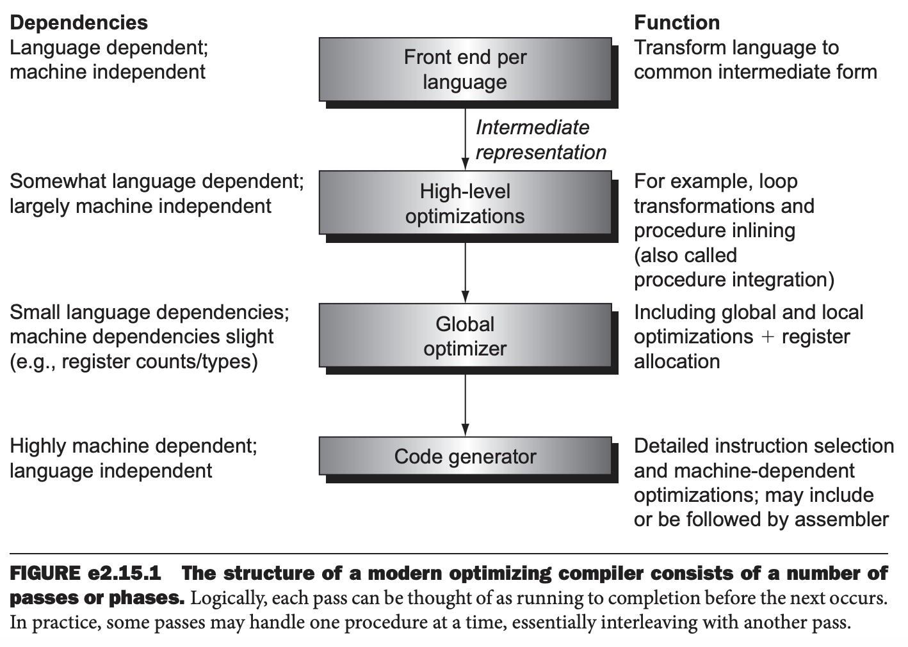

编译器对于性能的影响很大，所以了解编译器技术对于理解性能是非常重要的。不过整个编译器需要大量篇幅讲解，这里就涉及一些基础。

### Compiling C
现代编译器结构大致如下图所示，下面也按照这个顺序讲解。使用下面这个 `while` 循环作为例子来阐述概念。
```
while (save[i] == k)
    i += 1;
```



### The Front End

### High-Level Optimizations

### Local and Global Optimizations
