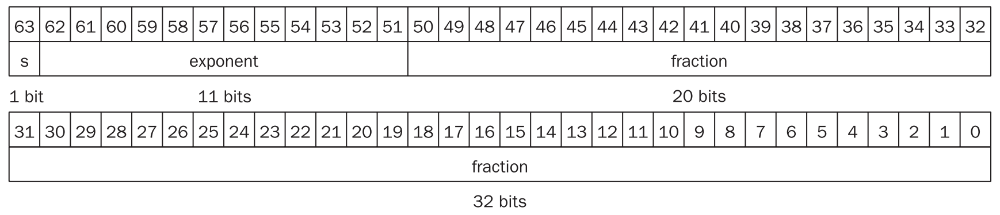
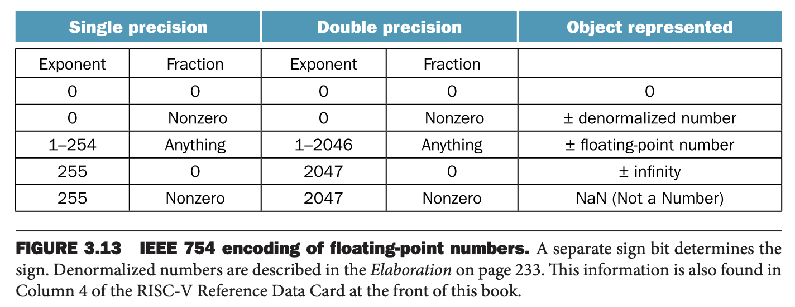

除了整数，编程语言还需要能够处理小数，数学中所说的实数。比如
$$\begin{aligned}
&3.14159265\ldots(\pi)\\
&2.71828\ldots(e)\\
&0.000000001, 1.0\times 10^{09}\\
&3,155,760,000,3.15576\times 10^9
\end{aligned}$$
第三个数表示一纳秒有多少秒，第四个数表示一个世纪有多少秒。最后一个数字不是小数，但是超过了 32 位比特能够表示的范围。

最后两个数字的第二种表示方法是科学计数法（`scientific notation`），小数点左表只有一个数字。使用科学计数法且不以零开头的数字称为标准形式（`normalized`），这种表示方式也很有用。$1.0\times 10^{-9}$ 是标准形式而 $0.1\times 10^{-8}$ 或 $10\times 10^{-10}$ 就不是标准形式。

二进制类似，以二为基底。

计算机中称为浮点数（`floating point`），因为当表示整数时小数点不固定。浮点数的二进制表示如下
$$1.xxxxxxxxx\times 2^{yyyy}$$
标准形式的好处有三：一个简化了涉及浮点数的数据交换，二是简化了浮点计算的算法，因为格式统一、一致，三是增加了能够表示的精度，因为不需要前面的无效的零。

### Floating-Point Representation
浮点数表示的设计者需要平衡小数（`fraction`）部分和指数（`exponent`）部分的大小，因为总长度是固定的。结果就是需要在精度（`precision`）和范围（`range`）之间取得平衡：增加小数部分的大小就是增加精度，相反增加指数部分的大小就是增加范围。

浮点数通常是字的若干倍。RISC-V 的浮点数表示如下所示。`s` 是符号位，1 表示负数，`exponent` 是指数部分，8 比特，`fraction` 是小数部分，23 比特。这种表示是符号和大小分离。

通常，浮点数的形式是
$$(-1)^S\times F\times 2^E$$
稍后会给出更精妙的设计和详细的解释。

这个选择使得浮点数能够表示的范围是相当大的，小到 $2.0\times 10^{-38}$，大到 $2.0\times 10^{38}$。表示的数字终究还是有范围的，因此，浮点数的运算和整数运算一样，会有溢出（`overflow`）的问题。

浮点数还一个特有的问题，就是一个非常非常小的非零小数，浮点数无法表示，这种情况称为下溢（`underflow`）。这种情况下，负指数绝对值太大而无法表示。

解决这些问题的一种方式是提供一种范围更大的浮点数表示。C 语言等很多语言都提供了两个字长度的浮点数，称为双精度（`double precision`），之前提到的浮点数格式称为单精度（`single precision`）。

RISC-V 提供双精度浮点数，格式如下图所示。指数部分有 11 比特，小数部分有 52 比特。

能够表示的范围就更大了，小到 $2.0\times 10^{-308}$ 大到 $2.0\times 10^{308}$。双精度不仅提高了范围，还提高了精度。

### Exceptions and Interrupts
当溢出或下溢发生的时候，如何让用户知道这个事情呢？有的计算机通过抛出异常（`exception`）给出信号，有时也称为中断（`interrupt`）。异常或者中断本质上是一个非计划中的过程调用（`procedure call`）。溢出指令的地址保存在寄存器中，计算机跳转到预先指定的地址调用合适的例程（`routine`）。中断地址也会被保存，这样某些情况下程序能够继续执行。4.9 节会给出异常的更多细节，第五章会描述更多发生异常的场景。RISC-V 在溢出或者下溢发生的时候抛出异常，软件需要读取浮点数状态寄存器（`floating-point control and status register`, `fcsr`）检查相关信息。

### IEEE 754 Floating-Point Standard
在上世纪 80 年代，浮点数标准（`IEEE 754 Floating-Point Standard`）被提出，这几乎和计算机同时诞生。这个标准提高了浮点数程序的可移植性和计算质量。

IEEE 754 标准将小数位前的 1 设计为隐式包含，所以单精度有效位数（`significand`）是 24 比特，双精度是 53 比特，比格式中小数部分的比特位多 1。

由于 0 没有前置的 1，所以使用指数和小数部分全零表示零。其他形式所表示的实数是
$$(-1)^S\times(1+F)\times 2^E$$
小数部分 $F$ 表示的值在 0 和 1 之间。

下图展示了 IEEE 754 标准编码的浮点数。一些特殊的符号表示特殊的事件。比如除零，得到的结果是 $\infty,-\infty$，此时指数最大。当打印的时候，会输出无穷（不是数学中的无穷概念）。

还有一些表示无效操作的结果，比如零除零或者无穷减无穷。符号是 NaN，Not a Number。这使得程序可以稍后对结果做测试并决定其行为。

IEEE 754 的一个设计目标是能够像整数比较一样很容易的比较两个浮点数。这就是为什么第一位是符号位，可以方便的和 0 进行比较。

指数放到小数部分的前面也是这个目的，如果符号位一样，那么指数大的数比指数小的数要大。

负指数的出现是一个挑战。如果使用补码或者其他最高位是 1 的编码表示负指数，那么看起来是一个很大的数。比如 $1.0\times 2^{-1}$ 的二进制表示是 `0 11111111 00000000000000000000000`。而 $1.0\times 2^1$ 的二进制表示是 `0 00000001 00000000000000000000000`。

因此，想要使用指数作比较，那么最小的负数应该用全零表示，最大的整数应该用全一表示。这称为移码（`biased notation`），从无符号数中减去偏移才是实际值。

IEEE 754 单精度数使用 127 作为移码的偏移，所以 -1 表示为 -1+127=126，二进制是 `0111 1110`，+1 表示为 1+127=128，二进制是 `1000 0000`。双精度使用 1023 作为移码的偏移。那么，IEEE 754 格式表示的实数是
$$(-1)^S\times(1+F)\times 2^{B}$$
因此单精度表示的范围是小到
$$\pm 1.00000000000000000000000\times 2^{-126}$$
大到
$$\pm 1.11111111111111111111111\times 2^{127}$$

### Converting Decimal Floating Point to Binary

#### Converting Binary to Decimal Floating Point
