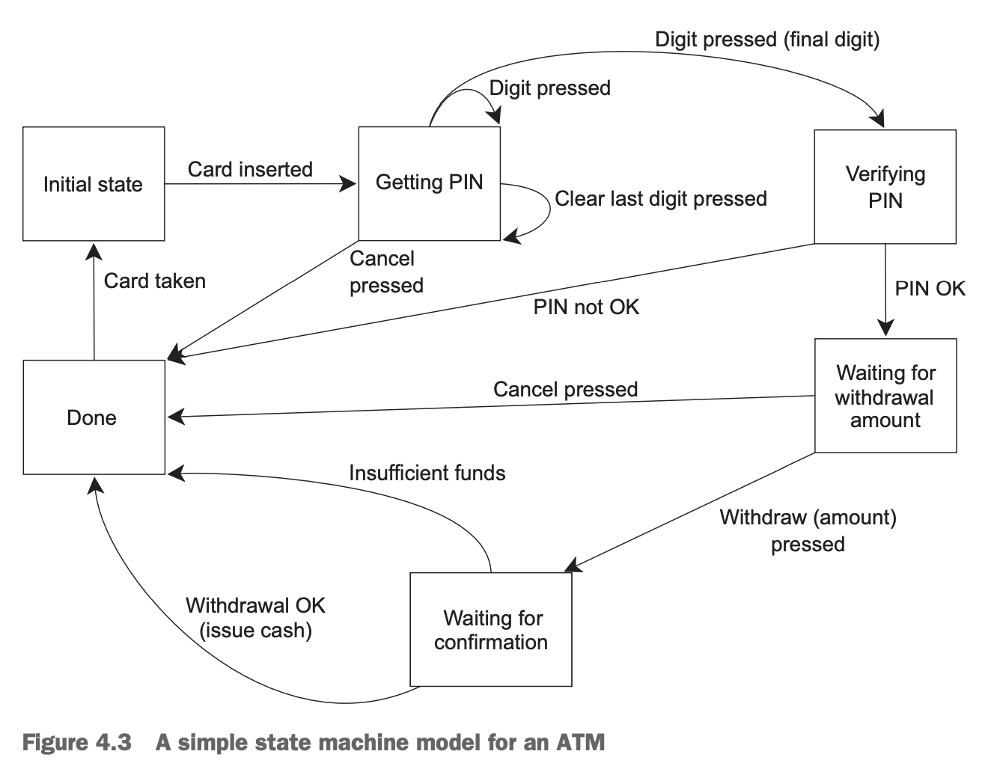

本章前面介绍了很多同步并行的方式，主要目的是可以简化代码，使得我们把焦点放到功能上。相比使用共享数据，我们更倾向于在不同任务之间传递数据，提供给任务必要的数据，从任务中获取需要的数据。

### Functional programming with futures
术语函数编程（`functional programming`, `FP`）是一种编程模式，函数的结果只依赖于输入的参数。这个概念借鉴了数学中函数的概念，只要输入一样，那么输出就一定一样。一个纯的函数不修改外部状态，其副作用仅限于其返回值。

这使得很多事情都更容易思考，尤其是在并发的情况下，因为第三章介绍的麻烦都是共享数据导致的。不修改数据，也就没有竞争，那么也不需要互斥保护数据。类似`Haskell`的语言纯函数式的，越来越流行。大部分函数都是纯函数，部分非纯函数需要修改状态，那么我们就能更加仔细推敲它们在整个应用中是否协调。

FP 并非仅限于函数式编程语言。C++是多范式，也可以支持函数式编程，C++11有了 lambda、类型推导、bind 等等，写函数式代码也更加容易。`future`是最后一个组件，为写并发的函数式代码提供了便利。`future`用于多线程之间传递数据，而不是修改共享数据。

#### FP-STYLE QUICKSORT
快排的原理就不在这里赘述了。下面是 FP 风格的实现，并不像`std::sort()`一样就地排序，而是通过复制链表实现的。
```cpp
template <typename T>
std::list<T> sequential_quick_sort(std::list<T> input)
{
    if (input.empty())
    {
        return input;
    }
    std::list<T> result;

    // 取第一个元素作为 pivot
    result.splice(result.begin(), input, input.begin());
    T const &pivot = *result.begin();

    // 使用 lambda 表达式声明分区函数，只用一次。引用捕捉避免复制
    auto divide_point = std::partition(input.begin(), input.end(),
                                       [&](T const &t)
                                       { return t < pivot; });

    // 链表中剩余元素从头到 divide_point 移动到 lower_part
    // input 里面剩余的就是比 pivot 大的元素了
    std::list<T> lower_part;
    lower_part.splice(lower_part.end(), input, input.begin(),
                      divide_point);

    // 递归排序两边，move 避免复制，结果会隐式的 move 出来
    auto new_lower(
        sequential_quick_sort(std::move(lower_part)));
    auto new_higher(
        sequential_quick_sort(std::move(input)));

    // 拼接结果，大的元素在后面拼接，小的元素从头拼接，pivot 本身就处于链表中间了
    result.splice(result.end(), new_higher);
    result.splice(result.begin(), new_lower);
    return result;
}
```

#### FP-STYLE PARALLEL QUICKSORT
已经有了函数式的快排实现，很容易利用`future`改写成并行版本。
```cpp
template <typename T>
std::list<T> parallel_quick_sort(std::list<T> input)
{
    if (input.empty())
    {
        return input;
    }

    std::list<T> result;
    result.splice(result.begin(), input, input.begin());
    T const &pivot = *result.begin();
    auto divide_point = std::partition(input.begin(), input.end(),
                                       [&](T const &t)
                                       { return t < pivot; });

    std::list<T> lower_part;
    lower_part.splice(lower_part.end(), input, input.begin(),
                      divide_point);

    // 最大的变化是这里：new_lower 不再在当前线程排序而不使用 std::async 在新线程进行排序
    std::future<std::list<T>> new_lower(
        std::async(&parallel_quick_sort<T>, std::move(lower_part)));

    // new_higher 仍旧是在当前线程排序，递归调用
    auto new_higher(
        parallel_quick_sort(std::move(input)));

    // new_higher 是在当前线程，可以直接使用
    result.splice(result.end(), new_higher);

    // 但是 new_lower 现在不是列表而是 future，所以需要获取结果
    // get() 返回的是右值引用，可以自动 move 出来
    result.splice(result.begin(), new_lower.get());

    return result;
}
```
上述代码会产生大量的线程，如果递归 10 次（1000+元素）就会产生 1024 个线程，希望硬件能处理的过来。如果类库意识到已经产生了太多的线程，后续的任务可能会同步的进行。如果依赖于类库自动扩展，那么用之前最好看一下文档确定其行为。

我们可以通过封装`std::packaged_task`和`std::thread`得到自行实现的`spawn_task()`版本。这个函数本身没有太多优势，不过如果我们希望把任务放到队列中同时利用线程池的话，那这个函数就为实现这些做好了准备。只有在知道自己在做什么并且希望控制线程池行为和任务执行的时候，这样做才有意义，否则不如使用`std::async`。
```cpp
template <typename F, typename A>
std::future<std::result_of<F(A &&)>::type>
spawn_task(F &&f, A &&a)
{
    typedef std::result_of<F(A &&)>::type result_type;
    std::packaged_task<result_type(A&&)> task(std::move(f)));
    std::future<result_type> res(task.get_future());
    std::thread t(std::move(task), std::move(a));
    t.detach();

    return res;
}
```
`std::async()`可以最大化利用硬件，这个函数仍旧有改进空间，比如`std::partition`也可以并行化起来。想要知道并发的最大能力，可以参考学术文章，或者看C++17并发库（第十章）。

FP 不是唯一绕过共享数据的编程范式，CSP（`Communicating Sequential Processes`）利用通信信道在线程之间传递数据，而线程在概念上是完全独立的。Erlang 就是如此，MPI 库也是如此。

###  Synchronizing operations with message passing
CSP 的想法很简答：没有共享数据，每个线程是独立的，只需要根据输入的信息做响应即可。每个线程就像一个独立的状态机，有一个初始状态，接受消息，修改自己的状态，或者给其他线程发消息。

CSP 没有共享数据，不过C++程序多线程情况下是共享地址空间的，不需要强行假设这一点。只需要在实现的时候保证线程之间没有共享数据即可。消息队列是共享的，但相关细节可由类库封装起来。

考虑 ATM 取钱的场景。我们可以有三个独立的线程分别处理 1）物理机器；2）ATM 逻辑；3）与银行通信 相关的事情即可。线程间发送消息而不是共享数据。下面是状态图。



根据状态变化，可以设计独立的类，每个类成员函数处理一种状态，等待接受消息，一旦接受到了按照既定逻辑处理，也有能转移到别的状态。下面代码是简单的实现，起始状态，等待用处插卡。

整个代码中需要同步的地方就是消息的传递，这被封装到了消息类库。附录 C 有全部代码，包括消息类库。
```cpp
struct card_inserted
{
    std::string account;
};

class atm
{
    messaging::receiver incoming;
    messaging::sender bank;
    messaging::sender interface_hardware;
    void (atm::*state)();
    std::string account;
    std::string pin;

    // 状态函数就是简单的成员函数
    void waiting_for_card()
    {
        // 向硬件接口线程发送消息
        interface_hardware.send(display_enter_card());

        // 等待消息
        // 唯一能处理的消息类型是 card_inserted
        // 这里使用 lambda 表达式作为处理逻辑
        // 可以传递任何函数作为 handle 的参数，这里使用 lambda 只是因为简单
        // 这里是链式调用，如果消息类型不是 card_inserted 那么消息会被废弃，继续等待下一个消息
        incoming.wait()
            .handle<card_inserted>(
                [&](card_inserted const &msg)
                {
                    // 缓存账户信息并情况 PIN 码
                    account = msg.account;
                    pin = "";

                    // 向硬件接口线程发送消息提示用户输入密码
                    interface_hardware.send(display_enter_pin());

                    // 状态发生了改变
                    state = &atm::getting_pin;
                });

        // 函数返回后 run 继续循环
    }

    void getting_pin();

public:
    // 线程从这里开始
    void run()
    {
        // 初始状态
        state = &atm::waiting_for_card;
        try
        {
            // 一直运行代表当前状态的函数
            for (;;)
            {
                (this->*state)();
            }
        }
        catch (messaging::close_queue const &)
        {
        }
    }
};
```
这里逻辑相对于真实场景已经经过了大量的简化，不过这里本身的目的是感受使用消息传递的编程风格。不需要考虑同步和并发，只需要关注消息到了处理和需要发送什么消息就足够了。ATM 逻辑是单独的一个线程，其他两个部分也是单独的线程。这个编程模式称为演员模型（Actor model），系统中有一些独立的演员，负责发送消息和接受消息，没有共享状态。

`getting_pin`稍微复杂一点，能够处理三种不同类型的消息。代码如下所示。
```cpp
void atm::getting_pin()
{
    incoming.wait()
        .handle<digit_pressed>(
            [&](digit_pressed const &msg)
            {
                unsigned const pin_length = 4;
                pin += msg.digit;
                if (pin.length() == pin_length)
                {
                    bank.send(verify_pin(account, pin, incoming));
                    state = &atm::verifying_pin;
                }
            })
        .handle<clear_last_pressed>(
            [&](clear_last_pressed const &msg)
            {
                if (!pin.empty())
                {
                    pin.resize(pin.length() - 1);
                }
            })
        .handle<cancel_pressed>(
            [&](cancel_pressed const &msg)
            {
                state = &atm::done_processing;
            });
}
```
这次需要传递三种消息，所以有三个`handle`，模板参数就对应的消息类型，`handle`参数是接受对应消息类型的 lambda 表达式，是处理消息的主体。仍旧是链式调用，`wait()`的实现知道是什么类型的函数，如果不是这三种类型，也会被丢弃。

这次我们不需要修改状态。`digit_pressed`仅仅是拼接一个数字直到满足条件。主循环会下次调用`getting_pin`来获取下一个数字或者处理取消等事件。

上面的状态流程图中每个方块表示有一个成员函数处理对应的消息，并且如果需要的话会更新状态。

你会发现这种编程风格处理并发非常简单，因为每一个线程都是独立的。这是一个展示如何用多线程来分离关注点的例子，这也需要仔细考虑如何划分不同的任务到对应的线程。

### Continuation-style concurrency with the Concurrency TS
Concurrency TS 在`std::experimental`命名空间提供了全新的`std::promise`和`std::packaged_task`，返回类型是`std::experimental::future`，其提供了新的关键功能——continuation。

假设你运行一个任务会返回一个结果，`future`用于存放结果。你必须使用`wait()`等待结果（或者用`wait_for()`或`wait_until()`等待有限的时间），然后处理结果。这很不方便，你可能需要一个语义：任务完成了，你继续后续的事情吧。这就是 continuation 提供的能力。调用`future`成员函数`then()`传递 continuation——`fut.then(continuation)`。

