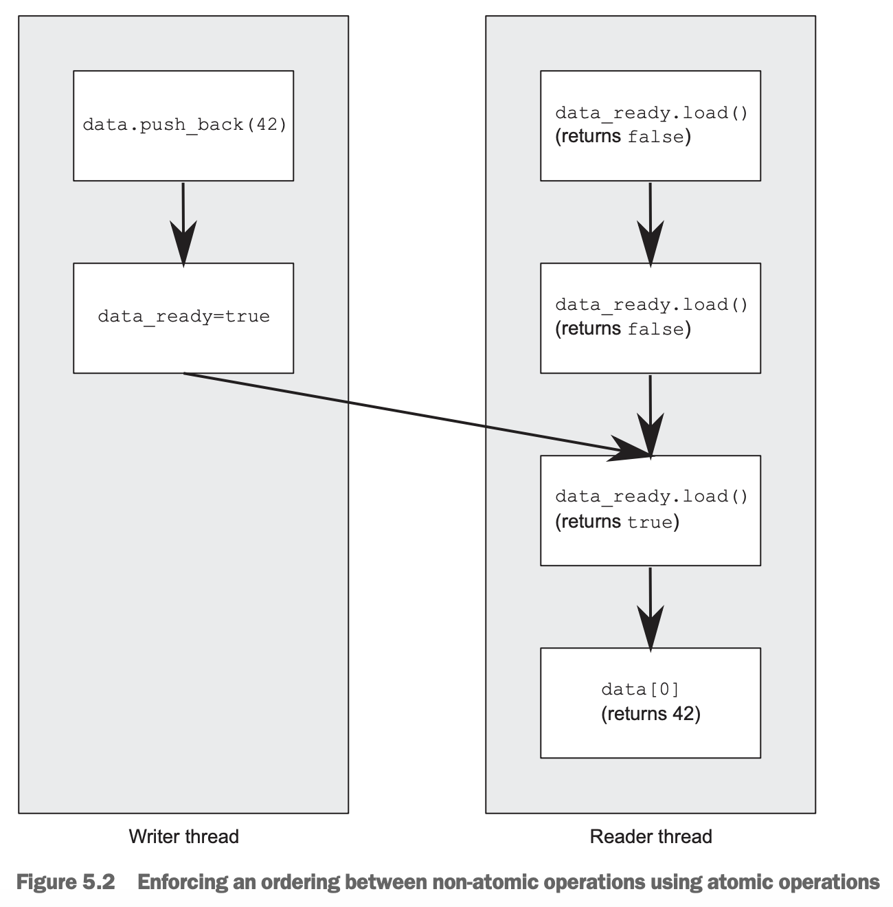
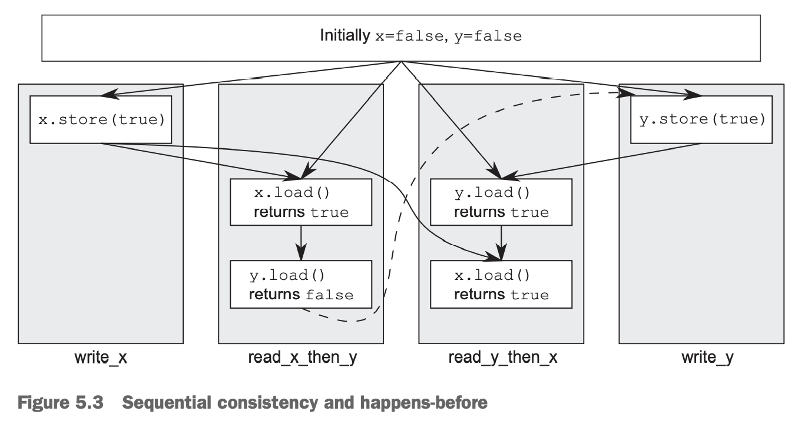
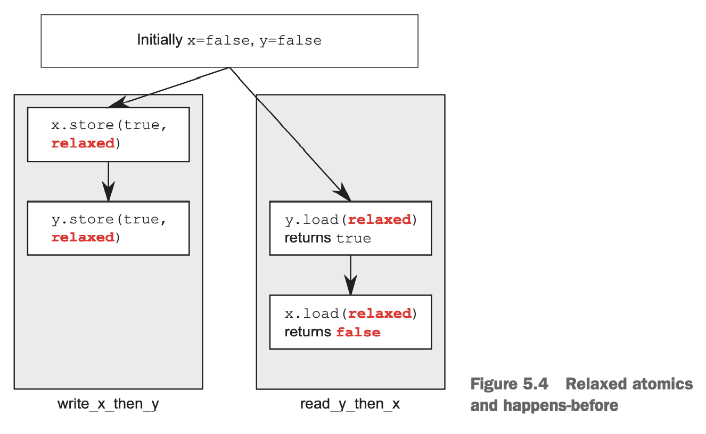

有两个线程，第一个往某个数据结构写数据，第二个从里面读数据。为了避免条件竞争，第一个线程写完数据之后设置一个标记，第二个线程在该标记设置之前不会尝试读数据。
```cpp
#include <vector>
#include <atomic>
#include <iostream>
std::vector<int> data;
std::atomic<bool> data_ready(false);

void reader_thread()
{
    while (!data_ready.load())
    {
        std::this_thread::sleep(std::chrono::milliseconds(1));
    }

    std::cout << "The answer =" << data[0] << "\n";
}

void writer_thread()
{
    data.push_back(42);
    data_ready = true;
}
```
如果想要读和写不发生竞争，必须要求他们按照先后顺序执行，而这一点是由 `atomic<bool> data_ready` 保证的，这是通过内存模型的关系 `happens-before` `synchronizes-with` 提供了顺序功能。写数据发生在 `data_ready` 设置之前，读标记发生在读数据之前。`happens-before` 具有传递性，那么读数据发生在写数据之前。整个流程如下图所示：



### The synchronizes-with relationship
`synchronizes-with` 是一种只能有原子操作提供的关系。

在合适的内存模型下，一个原子写操作 `W`，与一个原子读操作 `R` 同步，意味着 `R` 读到的是 1）`W` 写的；2）同一个线程 `W` 之后某个原子写操作的数据；3）任意线程执行的 `read-modify-write` 操作所修改的数据。`synchronizes-with` 关系就是在某个线程写和某个线程读之间的顺序关系。

### The happens-before relationship
`happens-before` 和 `strongly-happens-before` 是构建程序执行顺序的基石，意思是某个操作能够看到其他操作的影响。同一个线程内，一个操作在某个操作之前，即 `sequenced-before`，那么也就是 `happens-before`，也是 `strongly-happens-before`。`sequenced-before` 往往指一个线程内的情况。一般地，在前的语句和在后面的语句就有 `sequenced-before` 的关系。在一个语句中，则没有 `happens-before` 的关系。比如下面的程序输出 "1, 2" 或者 "2, 1" 都是有可能的。
```cpp
#include <iostream>
void foo(int a, int b)
{
    std::cout << a << ", " << b << std::endl;
}

int get_num()
{
    static int i = 0;
    return ++i;
}

int main()
{
    foo(get_num(), get_num());
}
```
一般情况下，同一个语句内的操作是没有确定的顺序关系的，不过，在一个语句中的所有操作都发生在后续语句的操作之前。

`inter-thread happens-before` 用来表示两个不同线程的操作的先后关系。

一般情况下，`inter-thread happens-before` 简单地依赖于 `synchronizes-with` 关系。一个线程的 A 操作和另一个线程的 B 操作同步，那么 A 操作发生在 B 操作之前。`inter-thread happens-before` 关系也有传递性。

`inter-thread happens-before` 可以和 `sequenced-before` 结合。比如 A 在 B 之前发生，B 在另一个线程 C 之前发生，那么 A 在 C 之前发生（`sequenced-before`）；或者 A 与 B 同步，B 在 C 之前发生，那么 A 在 C 之前发生。在一个线程内有一系列操作，想让另一个线程后续操作可见，只需要同步一次即可。

`strongly-happens-before` 有略微不同。A 和 B 如果是 `synchronizes-with` 或者 `sequenced-before` 关系，那么就是 `strongly-happens-before`。`strongly-happens-before` 也有传递性。`memory_order_consume` 内存模型下，`inter-thread-happens-before` 并不一定有 `strongly-happens-before`。大量代码并不会用这种内存模型，所以实际中不用太关心这个差别。

### Memory ordering for atomic operations
有六种内存顺序，`memory_order_relaxed`, `memory_order_consume`, `memory_order_acquire`, `memory_order_release`, `memory_order_acq_rel`, `memory_order_seq_cst`，默认情况下使用`memory_order_seq_cst`，这是最严格的类型。这六种可以分成三类：`sequentially consistent` 顺序（`memory_order_seq_cst`）, `acquire-release` 顺序（`memory_order_consume`, `memory_order_acquire`, `memory_order_release`, `memory_order_acq_rel`）,和 `relaxed ordering` 顺序（`memory_order_relaxed`）。

在不同的 CPU 架构上，不同的内存顺序有很大的性能差别。比如在一些体系上，为了让一个处理器上的修改能让其他处理器看见，为了实现 `sequentially consistent` 而不是 `acquire-release` 或 `relaxed ordering`，或者是为了实现 `acquire-release` 而不是 `relaxed ordering` ，需要一些额外的指令。如果处理器数量很大，这个开销会变大从而影响性能。对于 x86 架构的 CPU 而言，写操作都会有一个很小的额外开销，使得不管是哪一种内存顺序，都没有额外的指令。

不同的内存顺序使专家可以选择更小粒度更合适的内存模型以提升性能。

为了正确选择内存顺序，或者理解使用的这些内存顺序的代码，我们需要知道这些内存顺序是如何影响程序行为的。

#### SEQUENTIALLY CONSISTENT ORDERING
顺序一致（`sequentially consistent`）是默认值，它意味着程序的行为与按序执行是一致的。如果所有在原子类型上的操作都是顺序一致的，那么多线程执行就和以某种特定顺序在单个线程上执行是一样的。这是最简单的模型：所有的线程看到的顺序都是一样的。我们可以穷举所有可能的顺序，消除有矛盾的之后，那么程序的行为必定是其中之一。不能重新排序，如果一个执行在另一个线程的某个操作之前，那么所有的线程看到的都是这个顺序。

从同步的角度看，对同一个原子变量的写和读同步，那么读到的一定是刚写的值。这使得多线程操作有顺序约束。更重要的是，如果所有操作都是顺序一致，读在写之后，那么在读之后的操作，也必定在其他线程写之后。下面的例子会解释这一点。对于 `relaxed ordering`，这一点不成立，不同的线程可能会看到不同的顺序。

这种模型的代价是对于弱序（`weakly-ordered`）架构的机器来说，多个处理器之间会有昂贵的同步开销，因为为了让所有的处理器看到同样的顺序，需要大量（昂贵！）的同步指令。不过 x86 架构的同步相对轻量一些。

下面的代码读写 `x, y` 都显式地使用了 `memory_order_seq_cst`，尽管这不是必须的。
```cpp
#include <atomic>
#include <thread>
#include <assert.h>

std::atomic<bool> x, y;
std::atomic<int> z;

void write_x()
{
    x.store(true, std::memory_order_seq_cst);
}

void write_y()
{
    y.store(true, std::memory_order_seq_cst);
}

void read_x_then_y()
{
    while (!x.load(std::memory_order_seq_cst))
        ;
    if (y.load(std::memory_order_seq_cst))
        ++z;
}

void read_y_then_x()
{
    while (!y.load(std::memory_order_seq_cst))
        ;
    if (x.load(std::memory_order_seq_cst))
        ++z;
}

int main()
{
    x = false;
    y = false;
    z = 0;
    std::thread a(write_x);
    std::thread b(write_y);
    std::thread c(read_x_then_y);
    std::thread d(read_y_then_x);
    a.join();
    b.join();
    c.join();
    d.join();
    assert(z.load() != 0);
}
```
最后的 `assert` 永远为真，因为写 `x` 或者 `y` 一定有一个会先执行。假定 `read_x_then_y` 中检查 `y` 返回了 `false`，这意味着 `x` 一定被设置为了 `true`，那么在 `read_y_then_x` 中，等到 `y` 为 `true` 之后检查 `x` 就一定是 `true`。`memory_order_seq_cst` 保持全局顺序一致，一个线程看到 `x` 是 `true` 而 `y` 是 `false`，那么所有线程看到的都是这个顺序，也就意味着 `x` 比 `y` 先设置。

对称情况也是有可能的。另外一种可能是 `z` 是 2，这时 `assert` 条件也是成立的。

下图展示了上面详细描述的这种情况。虚线表示两者之间有顺序关系：为了出现我们描述的行为，`load` 一定比 `store` 先发生。



顺序执行最直观也最容易理解，但是可能会有很大的同步开销。为了消除这个开销，有时可以使用其他内存顺序。

#### NON-SEQUENTIALLY CONSISTENT MEMORY ORDERINGS
一旦走出顺序一致的世界，事情就变得复杂很多。核心就是不再有一个全局一致的事件顺序。大脑中关于线程交织执行的图像需要扔到一边。不仅仅真的并行执行，同时，所有线程并不会对事件顺序达成一致。写（甚至仅仅是理解）不用默认内存顺序的代码，始终要牢记这一点。即使多个线程同时执行同一个代码段，多个操作之间没有额外的约束，也就不会达成一致，这是因为不同 CPU 的缓存对同一个内存持有不同的值。再一次强调：没有全局一致的事件顺序。

线程交织执行要扔到一边，编译器或者处理器的乱序执行也要扔到一边。由于没有顺序约束，多个线程达成的唯一共识就是每一个独立变量的修改顺序是一致的。假设通过一些附加的顺序约束使得看到的值是一致的，不同线程上不同的操作仍旧以不同顺序出现。

首先看最松散的 `memory_order_relaxed` 内存顺序，之后再看其他类型，这样比较容易理解。

#### RELAXED ORDERING
宽松顺序（`relaxed ordering`）顺序不参与 `synchronizes-with` 关系。同一个线程内的 `happens-before` 关系是有的，除此之外，线程间几乎没有约束。一个线程内访问同一个原子变量不能乱序。一旦一个线程看到某个值，之后的操作不会再读到更早的值。对同一个变量的修改顺序达成一致外，多个线程之间看到的顺序就没有其他约束了。

下面的例子说明了宽松顺序的影响。
```cpp
#include <atomic>
#include <thread>
#include <assert.h>

std::atomic<bool> x, y;
std::atomic<int> z;

void write_x_then_y()
{
    x.store(true, std::memory_order_relaxed);
    y.store(true, std::memory_order_relaxed);
}

void read_y_then_x()
{
    while (!y.load(std::memory_order_relaxed))
        ;
    if (x.load(std::memory_order_relaxed))
        ++z;
}

int main()
{
    x = false;
    y = false;
    z = 0;
    std::thread a(write_x_then_y);
    std::thread b(read_y_then_x);
    a.join();
    b.join();
    assert(z.load() != 0);
}
```
最后的 `assert` 条件可能为 `false`。在一个线程中，我们先写 `x` 再写 `y`，再另一个线程中先确保 `y` 为真再读 `x`，但是后读 `x` 仍旧可能为 `false`。这是因为 `x, y` 是不同变量，不保证在所有线程看到的顺序都一样。

只要在约束下（比如同一个线程内）保证 `happens-before` 关系，不同变量之间可以任意重新排序。`synchronizes-with` 关系并没有被引入进来。下图是一种 `assert` 条件为 `false` 的情况。



尽管两个 `load` 和两个 `store` 之间有顺序保证，但是任意一个 `load` 和任意一个 `store` 之间是没有顺序保证的。

下面看一个更复杂的例子，涉及三个变量和五个线程。
```cpp
```
