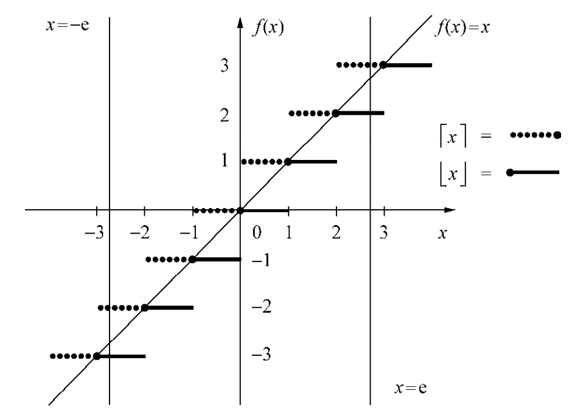

首先讨论底（`floor`）和顶（`ceiling`）两个函数。对任意实数 $x$，其定义是
$$\begin{aligned}
\lfloor x\rfloor=小于等于 x 的最大整数\\
\lceil x\rceil=大于等于 x 的最小整数
\end{aligned}\tag{3.1}$$

要熟悉底函数和顶函数，最好的方式是先了解其图像，其图像在 $f(x)=x$ 的上方或下方呈阶梯状。

由于 $e=2.71828...$，那么
$$\begin{aligned}
\lfloor e\rfloor=2,&\lfloor -e\rfloor=-3\\
\lceil e\rceil=3,&\lceil -e\rceil=-2
\end{aligned}$$

观察图形可以得到以下事实。底函数在 $f(x)=x$ 上或者下方，所以 $\lfloor x\rfloor\leq x$，类似的 $\lceil x\rceil\geq x$。同时两个函数在整数时值恰好相等。
$$\lfloor x\rfloor=x\Leftrightarrow x 是整数\Leftrightarrow \lceil x\rceil=x$$
如果不是整数，那么顶函数恰好比底函数大 1。
$$\lceil x\rceil-\lfloor x\rfloor=[x 不是整数]\tag{3.2}$$
上式使用了之前提到的艾佛森记号。

如果我们把对角线下移一个单位，那么就完全位于底函数下方，所以 $x-1<\lfloor x\rfloor$；类似的，$x+1>\lceil x\rceil$，结合起来得到
$$x-1<\lfloor x\rfloor\leq x\leq\lceil x\rceil<x+1\tag{3.3}$$
最后，两个函数关于坐标轴互为镜像。
$$\lfloor -x\rfloor=-\lceil x\rceil,\lceil -x\rceil=-\lfloor x\rfloor\tag{3.4}$$
用其中一个函数很容易表达另外一个。

下面四条法则是很有用的。
$$\begin{aligned}
\lfloor x\rfloor=n\Leftrightarrow n\leq x<n+1,&(a)\\
\lfloor x\rfloor=n\Leftrightarrow x-1<n\leq x,&(b)\\
\lceil x\rceil=n\Leftrightarrow n-1< x\leq n,&(c)\\
\lceil x\rceil=n\Leftrightarrow x\leq n< x+1,&(d)
\end{aligned}\tag{3.5}$$
其中 $(a),(c)$ 直接应用 $(3.1)$ 的定义即可。$(b), (d)$ 在定义的基础上调整了顺序使得 $n$ 在中间。

我们可以将一个整数移进或移出底函数和顶函数。
$$\lfloor x+n\rfloor=\lfloor x\rfloor+n, n 是整数\tag{3.6}$$
类似的，我们不能将常数因子移出或者移进底函数。比如当 $n=2,x=1/2$ 时，$\lfloor nx\rfloor\neq n\lfloor x\rfloor$。这说明底函数和顶函数不太灵活。

通常情况下，这两个函数是多余的，我们可以任意的添加或者删除这些函数表达式。比如下面是一组实数与整数之间的不等式等价于实数的底函数或顶函数与整数的关系：
$$\begin{aligned}
x<n\Leftrightarrow
\end{aligned}$$
